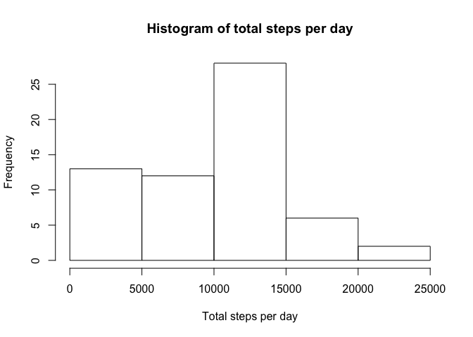
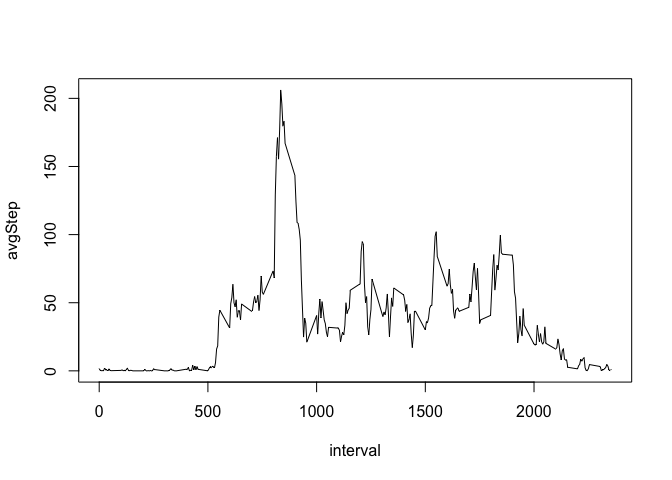
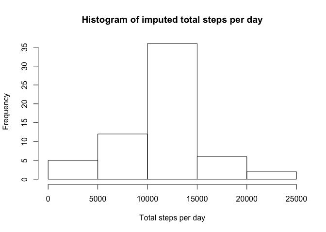
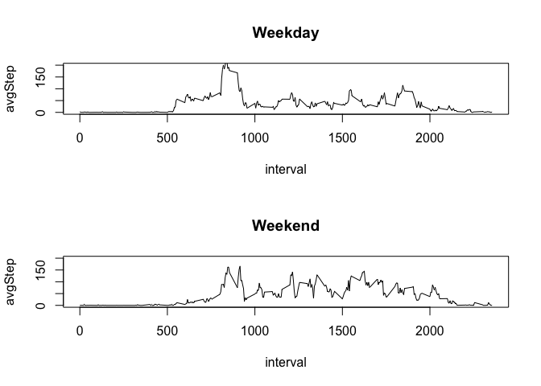

# Reproducible Research: Peer Assessment 1
## Setting up environment
Since we are gonna manipulate our data frame quite a lot, we choose to load `dplyr` package first.


```r
library(dplyr)
```

## Loading and preprocessing the data
In this part, we have `activity.csv` file provided in git repo. So we start with unzipping it then read it into R session.


```r
if(!file.exists("activity.csv")) {unzip("activity.csv")}
activity <- read.csv("activity.csv")
```

## What is mean total number of steps taken per day?
To answer the question, we group our dataset by date then calculate total number of steps taken per day. After that, we can easily calculage mean and median of it.


```r
totalStepsPerDay <- activity %>% group_by(date) %>% summarize(totalStep = sum(steps, na.rm = TRUE))
meanTotalStepPerDay <- mean(totalStepsPerDay$totalStep)
medianTotalStepPerDay <- median(totalStepsPerDay$totalStep)
cbind(meanTotalStepPerDay, medianTotalStepPerDay)
```

```
##      meanTotalStepPerDay medianTotalStepPerDay
## [1,]             9354.23                 10395
```

<!-- -->


## What is the average daily activity pattern?
To answer the question, we group our dataset by date then calculate average steps taken per day.


```r
avgStepsPerInterval <- activity %>% group_by(interval) %>% summarize(avgStep = mean(steps, na.rm = TRUE))
with(avgStepsPerInterval, plot(interval, avgStep, type = "l"))
```

<!-- -->

At 835 interval, we have highest number of steps

```r
avgStepsPerInterval[which.max(avgStepsPerInterval$avgStep),]
```

```
## # A tibble: 1 x 2
##   interval  avgStep
##      <int>    <dbl>
## 1      835 206.1698
```


## Imputing missing values
Number of missing values is:


```r
sum(is.na(activity$steps))
```

```
## [1] 2304
```

To impute missing values, we replace them with average steps per interval.


```r
activityNew <- activity %>% left_join(avgStepsPerInterval, by = "interval")
activityNew[is.na(activityNew$steps), "steps"] <- round(activityNew[is.na(activityNew$steps), "avgStep"])
activityImpute <- select(activityNew, -matches("avgStep"))
```


From the result, we can see that both `median imputed total steps per day` and `mean imputed total steps per day` increased


```r
imputedTotalStepsPerDay <- activityImpute %>% group_by(date) %>% summarize(totalStep = sum(steps))
meanImputedTotalStepPerDay <- mean(imputedTotalStepsPerDay$totalStep)
medianImputedTotalStepPerDay <- median(imputedTotalStepsPerDay$totalStep)
cbind(meanImputedTotalStepPerDay, medianImputedTotalStepPerDay)
```

```
##      meanImputedTotalStepPerDay medianImputedTotalStepPerDay
## [1,]                   10765.64                        10762
```

<!-- -->

## Are there differences in activity patterns between weekdays and weekends?
Weekdays is having higher average steps during morning hours whereas weeked is having higher averge steps after 10:00 AM.


```r
activityImpute$weekdays <- weekdays(as.Date(activityImpute$date))
avgStepsPerIntervalWeekday <- activityImpute %>% 
  filter(weekdays %in% c("Monday", "Tuesday", "Wednesday", "Thursday", "Friday")) %>% 
  group_by(interval) %>% 
  summarize(avgStep = mean(steps, na.rm = TRUE))

avgStepsPerIntervalWeekend <- activityImpute %>% 
  filter(weekdays %in% c("Saturday", "Sunday")) %>% 
  group_by(interval) %>% 
  summarize(avgStep = mean(steps, na.rm = TRUE))

par(mfrow = c(2, 1))
with(avgStepsPerIntervalWeekday, plot(interval, avgStep, type = "l", main = "Weekday", ylim = c(0, 200)))
with(avgStepsPerIntervalWeekend, plot(interval, avgStep, type = "l", main = "Weekend", ylim = c(0, 200)))
```

<!-- -->
